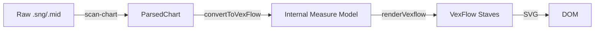

# Sheet Music Rendering

One of the core features of Spotify CloneHero is converting rhythm game charts (Clone Hero `.chart` / `.mid`) into readable drum sheet music. This is handled client-side using [VexFlow](https://github.com/0xfe/vexflow).

## Pipeline Overview

The transition from a raw chart file to visual sheet music involves several transformation steps:



## Key Components

### 1. Conversion (`app/sheet-music/[slug]/convertToVexflow.ts`)
This module translates the game-specific data structure into a musical representation.
-   **Quantization**: Notes are snapped to musical grids (16th notes, triplets, etc.).
-   **Mapping**: Game gems are mapped to drum notation:
    -   Kick -> F4 (Bottom space)
    -   Snare -> C5 (Middle space)
    -   Hi-Hat -> G5 (Top space, X head)
    -   Crashes -> A5 (Top line, X head)
-   **Rhythm Analysis**: It calculates note durations and groups them into beats and measures based on the time signature.

### 2. Rendering (`app/sheet-music/[slug]/renderVexflow.ts`)
Takes the internal `Measure` objects and uses VexFlow to draw them.
-   **Responsive Design**: Calculates `stavesPerRow` based on window width.
-   **Lyric Alignment**: Renders lyrics below the stave, handling overlaps.
-   **Highlights**: Generates a `timePositionMap` to map millisecond timestamps to X/Y coordinates on the SVG.

### 3. Playback Synchronization (`app/sheet-music/[slug]/SheetMusic.tsx`)
-   **Playhead**: Uses the `timePositionMap` to move a visual cursor over the notes as audio plays.
-   **Practice Mode**: Highlights specific measures for looping.

## Usage

The `SheetMusic` component is the main entry point:

```tsx
<SheetMusic
  chart={parsedChart}
  track={drumTrack}
  currentTime={audioTime}
  zoom={1.0}
  // ... callbacks
/>
```
